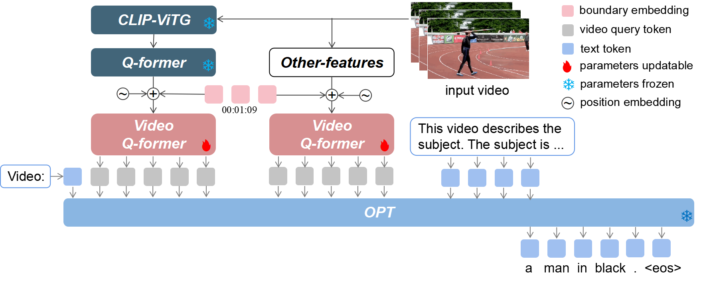

# LLMVA-GEBC: Large Language Model with Video Adapter for Generic Event Boundary Captioning

Code for the LOVEU@CVPR2023 Workshop Generic Event Boundary Captioning Chanllenge. Our proposed method achieved a 76.14 score on the test set and won the 1^{st} place in the challenge.

## Introduction

We proposes an effective model LLMVA-GEBC (Large Language Model with Video Adapter for Generic Event Boundary Captioning): 
(1) We utilize a pretrained LLM for generating human-like captions with high quality. 
(2) To adapt the model to the GEBC task, we take the video Q-former as an adapter and train it with the frozen visual feature extractors and LLM.

<p align="center" width="100%">
<a target="_blank"></a>
</p>

### Enviroment Preparation 

First, you should create a conda environment:
```
conda env create -f environment.yml
conda activate llmvagebc
```


## Prerequisite Checkpoints

Before using the repository, make sure you have obtained the following checkpoints:
- Get the original LLaMA weights in the huggingface format by following the instructions [here](https://huggingface.co/docs/transformers/main/model_doc/llama).
- Download [Vicuna delta weights](https://huggingface.co/lmsys/vicuna-13b-delta-v0). 
- Use the following command to add delta weights to the original LLaMA weights to obtain the Vicuna weights.

```
python apply_delta.py \
    --base /path/to/llama-13b \
    --target /output/path/to/vicuna-13b --delta /path/to/vicuna-13b-delta
```

- Download the MiniGPT-4 model (trained linear layer) from this [link](https://drive.google.com/file/d/1a4zLvaiDBr-36pasffmgpvH5P7CKmpze/view).


## Training
Firstly, set the `llama_model` and `ckpt` in [eval_configs/video_llama_eval.yaml](./eval_configs/video_llama_eval.yaml).
Then run the script
```
CUDA_VISIBLE_DEVICES=8 python train.py \
    --cfg-path train_configs/video_blip2_opt13b_full_12frame_intern_omni_clip_8tokens.yaml
```

## Acknowledgement
We are grateful for the following awesome projects our LLMVA-GEBC arising from:
* [BLIP-2](https://github.com/salesforce/LAVIS/tree/main/projects/blip2): Bootstrapping Language-Image Pre-training with Frozen Image Encoders and Large Language Models 
* [EVA-CLIP](https://github.com/baaivision/EVA/tree/master/EVA-CLIP): Improved Training Techniques for CLIP at Scale
* [Video-LLaMA](https://github.com/DAMO-NLP-SG/Video-LLaMA)
* [OPT](https://github.com/facebookresearch/metaseq):Open and Efficient Foundation Language Models
* [Kinetic-GEBC](https://github.com/showlab/geb-plus): The dataset consists of over 170k boundaries associated with captions describing status changes in the generic events in 12K videos.


## Citation
If you find our project useful, please cite the repo as follows:
```
@software{cvprw2023llmvagebc,
  author = {Tang, Yunlong and Zhang, Jinrui and Wang, Xiangchen and Wang, Teng and Zheng, Feng},
  title = {LLMVA-GEBC: Large Language Model with Video Adapter for Generic Event Boundary Captioning},
  year = 2023,
  url = {https://github.com/zjr2000/LLMVA-GEBC}
}
```

