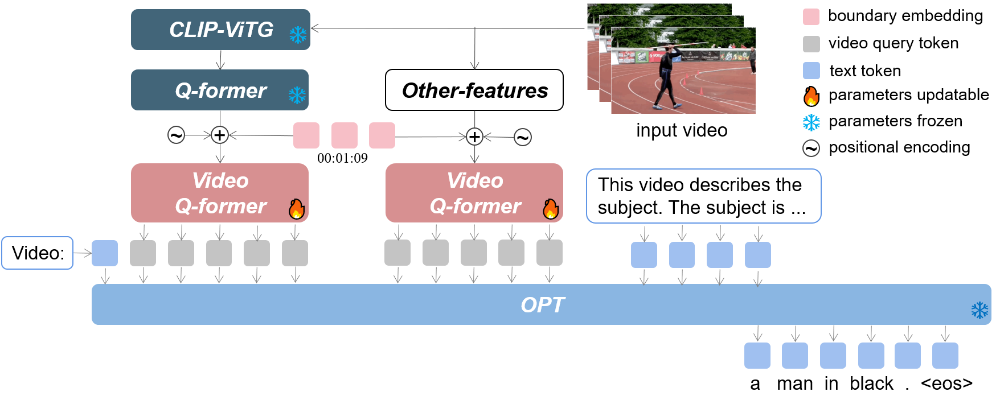

# LLMVA-GEBC: Large Language Model with Video Adapter for Generic Event Boundary Captioning

Code for the LOVEU@CVPR2023 Workshop Generic Event Boundary Captioning Chanllenge. Our proposed method achieved a **76.14** score on the test set and won the $1^{st}$ place in the challenge.

## Introduction

We proposes an effective model LLMVA-GEBC (Large Language Model with Video Adapter for Generic Event Boundary Captioning): 
(1) We utilize a pretrained LLM for generating human-like captions with high quality. 
(2) To adapt the model to the GEBC task, we take the video Q-former as an adapter and train it with the frozen visual feature extractors and LLM.

<p align="center" width="100%">
<a target="_blank"></a>
</p>

### Enviroment Preparation 

First, you should create a conda environment:
```
conda env create -f environment.yml
conda activate llmvagebc
```


## Prerequisite Checkpoints

Before using the repository, make sure you have obtained the following checkpoints:
- [pretrain-vicuna13b](https://huggingface.co/DAMO-NLP-SG/Video-LLaMA-Series/resolve/main/pretrain-vicuna13b.pth)
- [facebook/opt-13b](https://huggingface.co/facebook/opt-13b)

Remember to change the path of checkpoints `ckpt` in the config file.

## Data
Download the Kinetic-GEBC dataset from https://sites.google.com/view/loveucvpr23/track2.

**For primary visual feature:**
Using [BLIP-2](https://github.com/salesforce/LAVIS/tree/main/projects/blip2) to extract primary visual features. We use `feature_extraction.py` to do so. Remember to change the `video_dir` and `save_dir` in `train_configs/blip2_feature_extract.yaml`.

**For other visual features:**
[CLIP](https://github.com/openai/CLIP) to extract frame-level features and [Omnivore](https://github.com/facebookresearch/omnivore) to extract clip-level features. We use [this](https://github.com/zjr2000/Untrimmed-Video-Feature-Extractor) pipeline to extract features.

Then, put the extracted features under these three folders:
```
data/features/eva_vit_g_q_former_tokens_12
data/features/clip_fps_15_stride_1_rename,
data/features/omnivore_fps_15_len_16_stride_1_rename
``` 

You can also directly download the official provided features [here](https://sites.google.com/view/loveucvpr22/home). But, remember to change the ```q_former_feature_folder```, ```other_feat_total_size```, ```other_feature_names``` and ```other_feature_folders``` in the config file.


Using [VinVL](https://github.com/microsoft/scene_graph_benchmark) to extract region-level features. The region feature of a video is saved to multiple ```.npy``` files, where each single file contains the region feature of a sampled frame. Merge the feature file paths into  ```video_to_frame_index.json``` in the following format:
```
{
    "video_id": [
        "frame_1_feat.npy",
        "frame_2_feat.npy",
        ...     
    ],
    ...
}
``` 
Then put this file under ```data/features/```.


## Training and Validation
Firstly, set the configs in `train_configs/${NAME_OF_YOUR_CONFIG_FILE}.yaml`.
Then run the script
```
CUDA_VISIBLE_DEVICES=${YOUR_GPU_ID} python train.py \
    --cfg-path train_configs/${NAME_OF_YOUR_CONFIG_FILE}.yaml
```
The results can be found in `video_llama/output/`.

## Acknowledgement
We are grateful for the following awesome projects our LLMVA-GEBC arising from:
* [BLIP-2](https://github.com/salesforce/LAVIS/tree/main/projects/blip2)
* [Video-LLaMA](https://github.com/DAMO-NLP-SG/Video-LLaMA)
* [OPT](https://github.com/facebookresearch/metaseq)
* [Kinetic-GEBC](https://github.com/showlab/geb-plus)


## Citation
If you find our code useful, please cite the repo as follows:
```
@software{cvprw2023llmvagebc,
  author = {Tang, Yunlong and Zhang, Jinrui and Wang, Xiangchen and Wang, Teng and Zheng, Feng},
  title = {LLMVA-GEBC: Large Language Model with Video Adapter for Generic Event Boundary Captioning},
  year = 2023,
  url = {https://github.com/zjr2000/LLMVA-GEBC}
}
```

